# Skillected Jobs — Database Design (§78)

## 1. Engine strategy

Schema is authored **Postgres-ready** but runs on SQLite for Phase-1 dev:

- `INTEGER PRIMARY KEY AUTOINCREMENT` → Postgres `BIGSERIAL PRIMARY KEY` (adapter rewrites).
- `TEXT` timestamps ISO-8601 UTC → Postgres `TIMESTAMPTZ`.
- JSON stored as `TEXT` → Postgres `JSONB`.
- Indexes are explicit in DDL (no engine-specific magic).

`scripts/apply_migrations.py` applies `db/migrations/NNN_*.sql` in order and records them
in `schema_migrations`. `scripts/migrate_sqlite_to_postgres.py` ports data later.

## 2. ER diagram (Mermaid)

```mermaid
erDiagram
    users ||--o{ user_roles : has
    roles ||--o{ user_roles : grants
    users ||--o| candidate_profiles : "has (Phase 4)"
    users ||--o{ resumes : uploads
    resumes ||--o{ resume_skills : lists
    resumes ||--o{ resume_projects : lists
    companies ||--o{ company_locations : has
    companies ||--o{ career_sources : exposes
    career_sources ||--o{ source_runs : produces
    career_sources ||--o{ jobs : feeds
    companies ||--o{ jobs : posts
    jobs ||--o{ job_skills : requires
    skill_taxonomy ||--o{ job_skills : tags
    skill_taxonomy ||--o{ skill_aliases : canonicalizes
    jobs ||--o{ job_sources : "sourced from"
    jobs ||--o{ job_verification : verified-by
    jobs ||--o{ job_matches : matched-to
    users ||--o{ job_matches : receives
    users ||--o{ saved_jobs : saves
    users ||--o{ job_alerts : configures
    users ||--o{ notifications : receives
    jobs ||--o{ poster_assets : renders
    jobs ||--o{ qr_codes : encodes
    jobs ||--o{ application_clicks : receives
    users ||--o{ applications : tracks
    jobs ||--o{ applications : applied-to
    skill_taxonomy ||--o{ course_skills : taught-by
    courses ||--o{ course_skills : covers
    users ||--o{ course_recommendations : receives
    courses ||--o{ course_recommendations : suggested-in
    crawl_runs ||--o{ crawl_errors : logs
    users ||--o{ admin_actions : performs
    jobs ||--o{ job_reports : reported-by
    users ||--o{ placement_events : progresses
    applications ||--o{ placement_events : moves-through
```

## 3. Table catalog

| Table | Purpose | Phase |
|---|---|---|
| users, roles, user_roles, sessions | auth + RBAC | 1 |
| candidate_profiles | preferences, followed companies, experience | 1 (minimal), 4–5 |
| resumes, resume_skills, resume_projects | parsed resumes | 4 |
| companies, company_locations | employer registry | 1 |
| career_sources, source_runs | source registry + health (§50, §95) | 1 (registry), 2 (runs) |
| jobs, job_skills, job_sources | core job data (§11 field list) | 1 |
| job_verification | verification history + score breakdown | 2 (schema now) |
| job_matches | two-way match scores (§38) | 4 (schema now) |
| saved_jobs, job_alerts, notifications | personalization + alerts | 5 |
| poster_assets, qr_codes | content automation (§15–16) | 3 |
| application_clicks, applications | apply tracking + candidate pipeline (§43–44) | 1 (clicks), 6 |
| skill_taxonomy, skill_aliases | canonical skills + aliases (§57) | 1 |
| courses, course_skills, course_recommendations | Skillected learning bridge (§37) | 4–7 |
| crawl_runs, crawl_errors | ingestion telemetry (§53, §82) | 2 |
| admin_actions, job_reports | moderation + reporting (§67, §69) | 1 |
| placement_events | pipeline transitions (§43) | 6 |
| events | event outbox (§88) | 1 |
| schema_migrations | migration bookkeeping | 1 |

## 4. Key columns (jobs, §11)

`job_id PK · company_id FK · company_name (denormalized) · job_title ·
normalized_job_title · department · domain · sub_domain · location · city · state ·
country · work_mode · employment_type · experience_min · experience_max · education ·
skills (JSON) · technologies (JSON) · salary_min/max/currency · job_description ·
requirements (JSON) · preferred_skills (JSON) · source_type · source_url ·
application_url · official_company_url · job_requisition_id · posting_date ·
posting_date_verified · first_seen_at · last_verified_at · deadline · job_status ·
verification_status · verification_score · authenticity_score · duplicate_hash ·
is_demo · is_fresher_friendly · created_at · updated_at`

`is_demo` marks §84 demo rows; every demo job renders a **DEMO DATA** badge and demo
rows are excluded from stats/radar.

## 5. Integrity & indexes

- FKs enforced (`PRAGMA foreign_keys=ON` on SQLite).
- `UNIQUE(duplicate_hash)` where not null → hard duplicate barrier (§49).
- `UNIQUE(career_source_id, source_url)` → idempotent re-ingestion.
- Hot-path indexes: `jobs(status, city)`, `jobs(experience_min)`, `jobs(domain_id)`,
  `jobs(first_seen_at DESC)`, `jobs(published_at DESC)`, FTS via `LIKE` fallback
  (`normalized_job_title`, `company_name`) with Postgres full-text upgrade path.
- `application_clicks(job_id, clicked_at)` powers §64 analytics.
- `skill_aliases(alias_lower)` unique → O(1) alias resolution.
